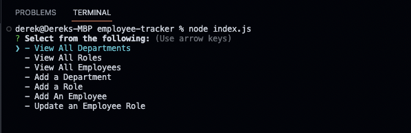
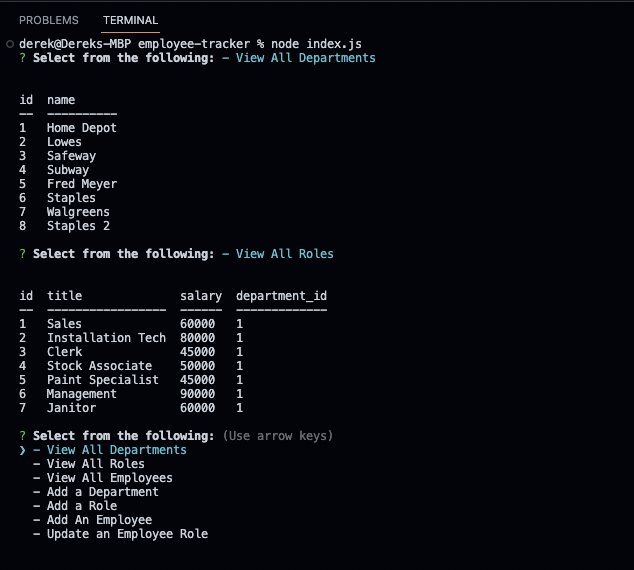
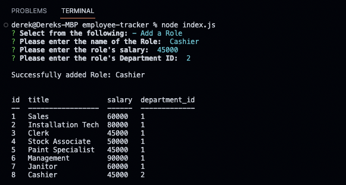

# Employee Tracker

## Table of Contents
1. [Description](#description)
2. [Installation](#installation)
3. [Usage](#usage)
4. [Contributing](#contributing)
5. [Tests](#tests)
6. [License](#license)
7. [Questions](#questions)
8. [Screenshots](#screenshots)

## Description
This application uses the command line interface to prompt the user from a series of options. Each option uses queries to create, read, update and delete employee information.

Technologies used for this application:
1. MySQL2
2. dotenv
3. inquirer
4. JavaScript
5. SQL

## Installation
1. Clone the repository to your machine.
2. To install the necessary packages, run "npm i" in your integrated terminal.
3. A .env file will need to be created in the root directory to store your database name, your database username, and database password. An example of this file can be seen [HERE](#dotenv-example)
4. Run "node index.js" in your integrated terminal to run the application.

## Usage
Quickly add, find, update and delete employee information saved to a local database.

## Contributing
This application is open source and can be used by anyone.

## Tests
No test suites have been run on this application at this time.

## License
This application is currently covered under the MIT License. More information about this license can be viewed under the file named 'LICENSE' in the repository.

## Questions
If you have any questions, feel free to reach out to me at my email: djohncaldwell@gmail.com

All of my work can be viewed at my GitHub profile: [CaldwellDerek](https://github.com/CaldwellDerek)

## Screenshots

### dotenv example:

### inital prompt example:

### view departments and roles example:

### adding a role example:
